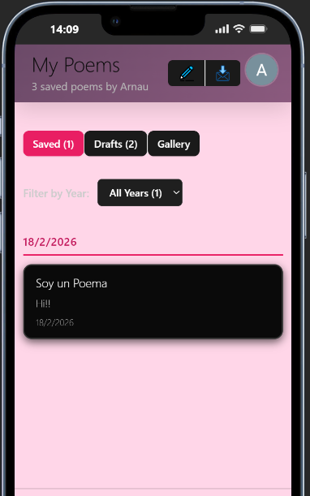
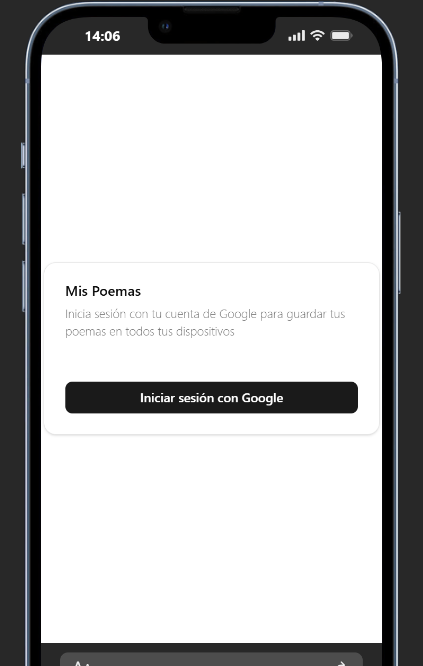

# ✍️ Ari Poems - Espacio de Escritura Creativa


> **"Elegí mis proyectos basándome en necesidades reales".** > Esta aplicación nace de una necesidad personal de un ser querido: un lugar minimalista, profesional y privado para capturar versos y emociones sin distracciones.

## 🚀 Características

* **Editor Profesional:** Zona de escritura optimizada para la creatividad.
* **Gestión de Estados:** Organización de poemas por categorías: *Todos, Guardados y Borradores*.
* **Almacenamiento en la Nube:** Integración con **Firebase Firestore** para los textos y **Firebase Storage** para las imágenes que acompañan cada obra.
* **Diseño Responsive:** Interfaz moderna con *Dark Mode* que se adapta a cualquier dispositivo.
* **Interacción Fluida:** Renderizado instantáneo gracias a la potencia de **Vite** y el Virtual DOM de **React**.

## 🛠️ Tecnologías utilizadas

* **Frontend:** React (Hooks: `useState`, `useEffect`, `props`).
* **Build Tool:** Vite (para un desarrollo ultra rápido).
* **Backend:** Firebase (Firestore & Storage).
* **Estilos:** CSS3 nativo con enfoque en Flexbox y CSS Grid.

## 📸 Demo Visual

| Home Page | Escritura |
| :---: | :---: |
|  |  |


## 📦 Instalación y Configuración

1. **Clona el repositorio:**
   ```bash
   git clone [https://github.com/TU_USUARIO/ari-poems.git](https://github.com/TU_USUARIO/ari-poems.git)
   cd ari-poems